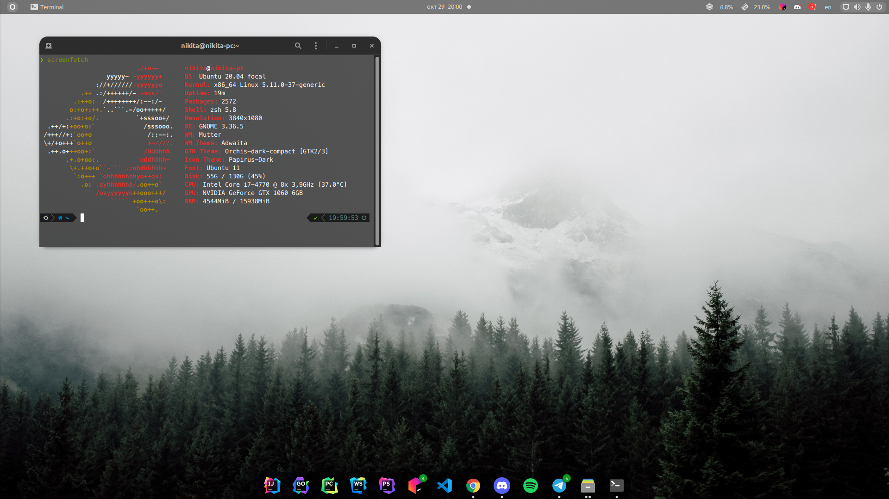

# My Ubuntu setup

Table of contents:
1. [Theme](#Theme)
2. [Audio device setup](#Audio-device-setup)
3. [Dual Boot Time Sync](#Dual-Boot-Time-Sync)
4. [Bluetooth Dual Boot Pairing](#Bluetooth-Dual-Boot-Pairing)

## Theme



* [wallpaper](https://wallpaperaccess.com/full/1678137.jpg)
* tweaks
    * appearance
        * applications: [Orchis-dark-compact](https://github.com/vinceliuice/Orchis-theme) (`--tweaks compact`)
        * cursor: Yaru
        * icons: [Papirus-Dark](https://github.com/PapirusDevelopmentTeam/papirus-icon-theme)
        * shell: Orchis-dark-compact
        * sound: Yaru
    * extensions
        * [dynamic panel transparency](https://extensions.gnome.org/extension/1011/dynamic-panel-transparency/)
            * background
                * maximized opacity: 100%
                * unmaximized opacity: 49%
                * hide corners
        * [simple monitor](https://extensions.gnome.org/extension/3891/simple-monitor/)
        * ubuntu dock
        * user themes
    * fonts
        * inteface text: Ubuntu Regular 11
        * document text: Sans Regular 11
        * monospace text: Ubuntu Mono Regular 13
        * legacy window titles: Ubuntu Regular 11
        * hinting: slight
        * antialiasing: subpixel
        * scaling factor: 1.00

### Dock conf
In the file.

To copy settings into your config use:
```Bash
dconf load /org/gnome/shell/extensions/dash-to-dock/ < dash-to-dock.conf
```

## Audio device setup


I spent lots of time setting up my audio environment on Ubuntu and it's a pure hell for a person who's not familiar with Linux.
1. Download `pavucontrol`:
```
sudo apt update && sudo apt install pavucontrol
```
2. Go to `Configuration` tab and disable all unused micro by clicking `Off` in dropdown menu.
3. Switch all your discrete microphones profiles from `Duplex` into `Input` (microphone is not an output device).
4. Switch all your discrete headphones profiles from `Duplex` into `Output`.

**If you have headset with mic leave `Duplex` as it is.**

### Set default audio (optional)

I use AKG Lyra & default stereo headphones preset (the command below is added into `Startup Applications`):

```
pactl set-default-sink alsa_output.pci-0000_00_1b.0.analog-stereo &&  pactl set-default-source alsa_input.usb-AKG_C44-USB_Microphone_AKG_C44-USB_Microphone-00.analog-stereo
```

To list your input and output devices use `pactl list short sinks` and `pactl list short sources`

## Dual Boot Time Sync

In Linux, use:
```
timedatectl set-local-rtc 1
```

## Bluetooth Dual Boot Pairing

Link:
https://unix.stackexchange.com/questions/255509/bluetooth-pairing-on-dual-boot-of-windows-linux-mint-ubuntu-stop-having-to-p
