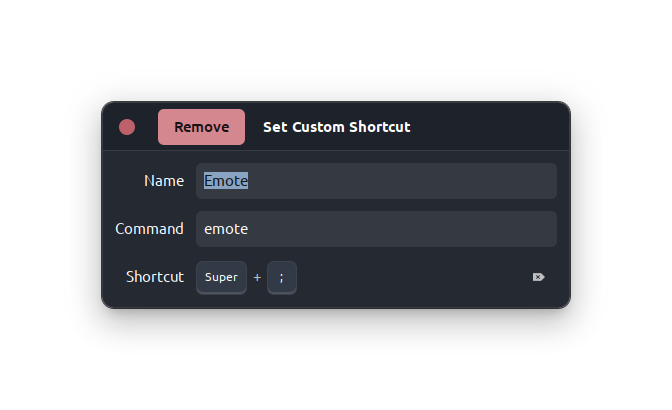

# 🛠️ My Ubuntu setup for development

 


### Hello everyone! 👋

I want to share with you an Ubuntu setup which I carefully built for myself. As a developer, I want my system not only to has all neccessary tools but to look nice. I hope you to enjoy my build!

Feel free to ask me using **[email](mailto:rusetscky@outlook.com)**.

P.S. I'm still working on this and I haven't added everything that I want atm. Thank you for understanding 🙏

---

**Table of contents:**
- [🛠️ My Ubuntu setup for development](#️-my-ubuntu-setup-for-development)
    - [Hello everyone! 👋](#hello-everyone-)
  - [Theme](#theme)
    - [Shell](#shell)
    - [Make other apps look native](#make-other-apps-look-native)
      - [Chrome](#chrome)
      - [Telegram](#telegram)
  - [Tweaks and extensions](#tweaks-and-extensions)
    - [Appearance](#appearance)
    - [Fonts](#fonts)
    - [Extensions](#extensions)
    - [Dock conf](#dock-conf)
  - [Audio device setup](#audio-device-setup)
    - [Set default audio (optional)](#set-default-audio-optional)
  - [Dual Boot Time Sync](#dual-boot-time-sync)
  - [Bluetooth Dual Boot Pairing](#bluetooth-dual-boot-pairing)
  - [Keyboard Shortcuts](#keyboard-shortcuts)
  - [Software](#software)
    - [Virtual Webcam Background](#virtual-webcam-background)
    - [Terminal Tabby](#terminal-tabby)
      - [Install `oh-my-zsh` and `p10k`](#install-oh-my-zsh-and-p10k)
  - [Development setup](#development-setup)
    - [Spacevim](#spacevim)
    - [VS Code](#vs-code)
  - [Other tools](#other-tools)
    - [Emotes](#emotes)

---

## Theme

### Shell

I copied almost everything from **[ArcTechnologies](https://www.youtube.com/channel/UCtKKEqJIPCT9E6WMas7lC5Q)** (YouTube). I recommend to check their channel and video of setting up a Nord theme for GNOME Desktop.

<a href="https://www.youtube.com/watch?v=gx1hEQSOAyg"></a>

Wallpaper is taken from **[nordthemewallpapers.com](https://nordthemewallpapers.com)**:

<a href="https://nordthemewallpapers.com/Backgrounds/16-9/All/img/3mcg97oyotu61.jpg"></a>

Install Colloid-dark-nord theme:
```bash
$ curl -LJO https://github.com/vinceliuice/Colloid-gtk-theme/archive/refs/heads/main.zip && unzip 
Colloid-gtk-theme.zip && cd Colloid-gtk-theme && sh -c install.sh --tweaks nord
```

### Make other apps look native

#### Chrome
Go to `Settings` -> `Apperance` -> `Theme` and set it to `GTK+`


#### Telegram
Go to `Settings` -> `Advanced` -> `System integration` -> `Use system window frame`


## Tweaks and extensions

Install GNOME Tweaks:

```bash
$ sudo apt install gnome-tweaks
```

### Appearance


| Themes              | Value                                                                                   |
| ------------------- | --------------------------------------------------------------------------------------- |
| Cursor              | Yaru                                                                                    |
| Icons               | Mkos-Big-Sur                                                                            |
| Shell               | [Colloid-dark-nord](https://github.com/vinceliuice/Colloid-gtk-theme) (`--tweaks nord`) |
| Sound               | Yaru                                                                                    |
| Legacy Applications | [Colloid-dark-nord](https://github.com/vinceliuice/Colloid-gtk-theme) (`--tweaks nord`) |

### Fonts


| Type                 | Font                | Size |
| -------------------- | ------------------- | ---- |
| Interface Text       | Ubuntu Regular      | 11   |
| Document Text        | Sans Regular        | 11   |
| Monospace            | Ubuntu Mono Regular | 13   |
| Legacy Window Titles | Ubuntu Regular      | 11   |

- hinting: full (you can also 
- antialiasing: subpixel
- scaling factor: 1.00

### Extensions

- [dynamic panel transparency](https://extensions.gnome.org/extension/1011/dynamic-panel-transparency/)
   - background
       - maximized opacity: 100%
       - unmaximized opacity: А49%
       - hide corners
- [simple monitor](https://extensions.gnome.org/extension/3891/simple-monitor/)
- [Unite](https://extensions.gnome.org/extension/1287/unite/)
- [window is ready notification remover](https://extensions.gnome.org/extension/1007/window-is-ready-notification-remover/)
- ubuntu dock
- user themes

### Dock conf
In the file.

To copy settings into your config use:
```Bash
$ dconf load /org/gnome/shell/extensions/dash-to-dock/ < dash-to-dock.conf
```

## Audio device setup


I spent lots of time setting up my audio environment on Ubuntu and it's a pure hell for a person who's not familiar with Linux.
1. Download `pavucontrol`:
```
$ sudo apt update && sudo apt install pavucontrol
```
2. Go to `Configuration` tab and disable all unused micro by clicking `Off` in dropdown menu.
3. Switch all your discrete microphones profiles from `Duplex` into `Input` (microphone is not an output device).
4. Switch all your discrete headphones profiles from `Duplex` into `Output`.

**If you have headset with mic leave `Duplex` as it is.**

### Set default audio (optional)

I use AKG Lyra & default stereo headphones preset (the command below is added into `Startup Applications`):

```
$ pactl set-default-sink alsa_output.pci-0000_00_1b.0.analog-stereo &&  pactl set-default-source alsa_input.usb-AKG_C44-USB_Microphone_AKG_C44-USB_Microphone-00.analog-stereo
```

To list your input and output devices use `pactl list short sinks` and `pactl list short sources`

## Dual Boot Time Sync

In Linux, use:
```
$ timedatectl set-local-rtc 1
```

## Bluetooth Dual Boot Pairing

Link:
https://unix.stackexchange.com/questions/255509/bluetooth-pairing-on-dual-boot-of-windows-linux-mint-ubuntu-stop-having-to-p

## Keyboard Shortcuts
- Copy a screenshort of an area to clipboard: `Shift` + `Super` +`S`
- Home folder: `Super` + `E`
- Launch terminal: `Super` + `T`

## Software
### [Virtual Webcam Background](https://github.com/fangfufu/Linux-Fake-Background-Webcam)
To use blur or any other webcam background at work.

### Terminal [Tabby](https://github.com/Eugeny/tabby)


Amazing terminal!
1. Download latest release **[here](https://github.com/Eugeny/tabby/releases)**.
2. Install `.deb` file.
```bash
$ sudo dpkg -i tabby-1.0.177-linux-x64.deb
```
3. Make Tabby a default terminal.
Add Tabby to terminals list.
```bash
$ sudo update-alternatives --install /usr/bin/x-terminal-emulator x-terminal-emulator /usr/bin/tabby 1
```
Change default terminal by choosing Tabby in the list by running this command:
```bash
$ sudo update-alternatives --config x-terminal-emulator
```

#### Install `oh-my-zsh` and `p10k`

Install `oh-my-zsh`:

```bash
$ sh -c "$(curl -fsSL https://raw.githubusercontent.com/ohmyzsh/ohmyzsh/master/tools/install.sh)" && chsh -s $(which zsh)
```

Install `p10k`:
```bash
$ git clone --depth=1 https://github.com/romkatv/powerlevel10k.git ${ZSH_CUSTOM:-$HOME/.oh-my-zsh/custom}/themes/powerlevel10k
```

Set `zsh` as default shell:
```
$ chsh -s $(which zsh)
```

Configure `p10k`:
```
$ p10k configure
```

## Development setup

Let's start with basic tools like `build-essential`:

```bash
$ sudo apt install build-essential 
```

### Spacevim

Install SpaceVim:
```bash
$ curl -sLf https://spacevim.org/install.sh | bash
```

### VS Code

**Theme:** Copilot Theme


Install:
```bash
$ sudo snap install --classic code
```
I use these extensions: 
- Java/Kotlin dev:
  - [Debugger for Java](https://marketplace.visualstudio.com/items?itemName=vscjava.vscode-java-debug) `ext install vscjava.vscode-java-debug`
  - [Extension Pack for Java](https://marketplace.visualstudio.com/items?itemName=vscjava.vscode-java-pack) `ext install vscjava.vscode-java-pack`
  - [Kotlin](https://marketplace.visualstudio.com/items?itemName=fwcd.kotlin) `ext install fwcd.kotlin`
  - [Kotlin Language](https://marketplace.visualstudio.com/items?itemName=mathiasfrohlich.Kotlin) `ext install mathiasfrohlich.Kotlin`
  - [Maven for Java](https://marketplace.visualstudio.com/items?itemName=vscjava.vscode-maven) `ext install vscjava.vscode-maven`
  - [Project Manager for Java](https://marketplace.visualstudio.com/items?itemName=vscjava.vscode-java-dependency) `ext install vscjava.vscode-java-dependency`
  - [Language Support for Java(TM) by Red Hat](https://marketplace.visualstudio.com/items?itemName=redhat.java) `ext install redhat.java`
  - [Test Runner for Java](https://marketplace.visualstudio.com/items?itemName=vscjava.vscode-java-test) `ext install vscjava.vscode-java-test`
- Frontend:
  - [Bootstrap 5 & Font Awesome Snippets](https://marketplace.visualstudio.com/items?itemName=HansUXdev.bootstrap5-snippets) `ext install HansUXdev.bootstrap5-snippets`
  - [Tailwind CSS IntelliSense](https://marketplace.visualstudio.com/items?itemName=bradlc.vscode-tailwindcss) `ext install bradlc.vscode-tailwindcss`
- Markdown
  - [Markdown All in One](https://marketplace.visualstudio.com/items?itemName=yzhang.markdown-all-in-one) `ext install yzhang.markdown-all-in-one`
  - [Markdown PDF](https://marketplace.visualstudio.com/items?itemName=yzane.markdown-pdf) `ext install yzane.markdown-pdf`
  - [Markdown Table](https://marketplace.visualstudio.com/items?itemName=TakumiI.markdowntable) `ext install TakumiI.markdowntable`
  - [LaTeX](https://marketplace.visualstudio.com/items?itemName=mathematic.vscode-latex) `ext install mathematic.vscode-latex`
- general dev:
  - [Docker](https://marketplace.visualstudio.com/items?itemName=ms-azuretools.vscode-docker) `ext install ms-azuretools.vscode-docker`
  - [GitHub Copilot](https://marketplace.visualstudio.com/items?itemName=GitHub.copilot) `ext install GitHub.copilot`
  - [IntelliCode](https://marketplace.visualstudio.com/items?itemName=VisualStudioExptTeam.vscodeintellicode) `ext install VisualStudioExptTeam.vscodeintellicode`
  - [Live Preview](https://marketplace.visualstudio.com/items?itemName=ms-vscode.live-server) `ext install ms-vscode.live-server`

And themes:
- [Copilot Theme](https://marketplace.visualstudio.com/items?itemName=BenjaminBenais.copilot-theme) `ext install BenjaminBenais.copilot-theme`
- [GitHub Theme](https://marketplace.visualstudio.com/items?itemName=GitHub.github-vscode-theme) `ext install GitHub.github-vscode-theme`
- [One Monokai Theme](https://marketplace.visualstudio.com/items?itemName=azemoh.one-monokai) `ext install azemoh.one-monokai`

To install extensions that I use type:
```bash
$ ./vscode-install-ext.sh
```

## Other tools

### Emotes

I miss `Ctrl` + `;` emote picker from Windows a lot so I decided to search for an Ubuntu analog and found `emote`! It's great! Let's install it using snap!

```bash
$ sudo snap install emote
```

It looks like this:


Don't forget to bind it to `Ctrl` + `;` (`Settings` -> `Keyboard` -> `Keyboard Shortcuts` -> `View and Customize Shortcuts` -> `Custom Shortcuts` ->  Click `+` and add command `emote` to shortcut just like on screenshot below).

    